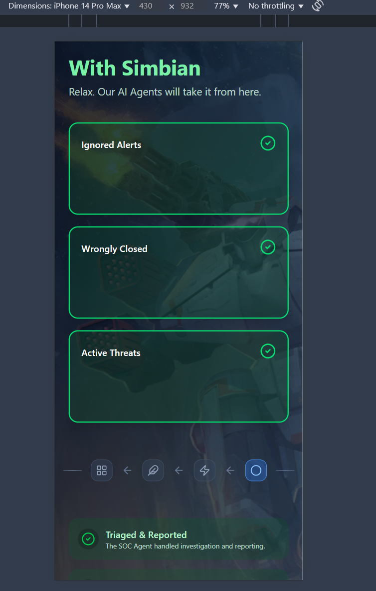

# Simbian Security Operations Comparison Section Assignment

Developed a modern and interactive section for Simbian Security, allowing users to clearly see the difference between using Simbian Security and not using it. I designed a comparison slider that users can interact with to visualize the improvements Simbian Security provides.

I added multiple components with motion-based animations while maintaining a consistent directory structure and naming convention. I used useState and useEffect hooks for state management and side effects, setting up the project in a way that's scalable and easy to maintain.


The project is built with the Next.js App Router, using TypeScript and Tailwind CSS for styling, as per the requirements. It has been deployed on Vercel.

## ✨ Features

- **Next.js Framework**: Next.js Framework used with App Router
- **Tailwind CSS**: Styling done with Tailwind CSS
- **Motion**: Animations done with Framer Motion
- **Lucide React**: Icons provided by Lucide React
- **Next-themes**: Dark/Light mode support with Next-themes
- **Responsive Design**: Fully responsive layout that works on mobile, tablet, and desktop
- **Dark/Light Mode**: System-aware theme with manual toggle option
- **Smooth Animations**: Engaging motion effects using Framer Motion
- **Modern UI Components**: Built with Tailwind CSS
- **Comments Included**

### Dynamic Comparison View
- Split-screen visualization
- Draggable comparison slider
- Animated transitions between states
- Responsive layout adaptation
- Status indicators
- Status updates

### Alert Management
- Real-time alert notifications
- Counter animations
- Status indicators

### Areas of Improvement
- Dynamic data fetching
- Using of ShadCN ui components for faster and smoother development process

## 🏃‍♂️ Getting Started

1. Clone the repository:
```bash
git clone <https://github.com/Nikhileshrana/simbian-assignment.git>
```

## Images

### Without Simbian Security

### With Simbian Security

### Tablet View

### Mobile View

### Light Mode


### Light House Scores


