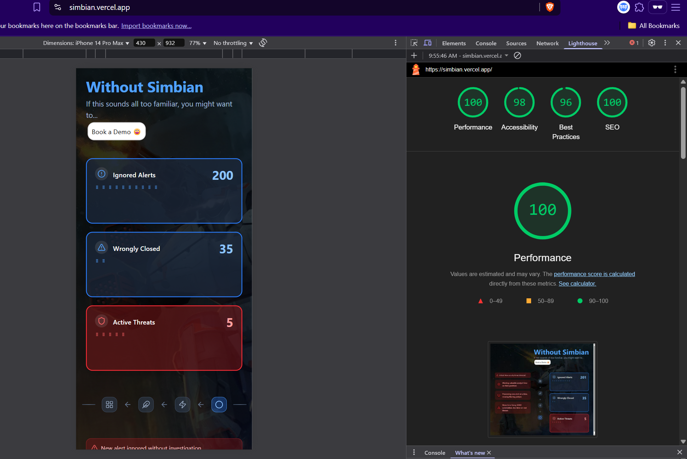

# Simbian Security Operations Comparison Section Assignment

Developed a modern look and feel section for simbian Security. 
where users can see the clear difference between using simbian security or not. I though of creating something that users can interact with so came up with this slider and comparison slider where users can actually see the difference between simbian security and not using simbian security.

i have added multiple components and used motion for animations.where i have maintained consistent directory structure and naming convention. i have added
usestate, useeffect hooks for state management and sideoperations. i have set things up in such a way that it can be easily scalable and maintainable.


I used Next.js Framework with App Router for the project with typescript and tailwind css for styling as per the requirements. I have deployed the project on vercel.

## ✨ Features

- **Next.js Framework**: Next.js Framework used with App Router
- **Tailwind CSS**: Styling done with Tailwind CSS
- **Motion**: Animations done with Framer Motion
- **Lucide React**: Icons provided by Lucide React
- **Next-themes**: Dark/Light mode support with Next-themes
- **Responsive Design**: Fully responsive layout that works on mobile, tablet, and desktop
- **Dark/Light Mode**: System-aware theme with manual toggle option
- **Smooth Animations**: Engaging motion effects using Framer Motion
- **Modern UI Components**: Built with Tailwind CSS
- **Comments Included**

### Dynamic Comparison View
- Split-screen visualization
- Draggable comparison slider
- Animated transitions between states
- Responsive layout adaptation
- Status indicators
- Status updates

### Alert Management
- Real-time alert notifications
- Counter animations
- Status indicators

### Areas of Improvement
- Dynamic data fetching
- Using of ShadCN ui components for faster and smoother development process

## 🏃‍♂️ Getting Started

1. Clone the repository:
```bash
git clone <https://github.com/Nikhileshrana/simbian-assignment.git>
```

## Images

### Without Simbian Security

### With Simbian Security

### Tablet View

### Mobile View

### Light Mode


### Light House Scores


